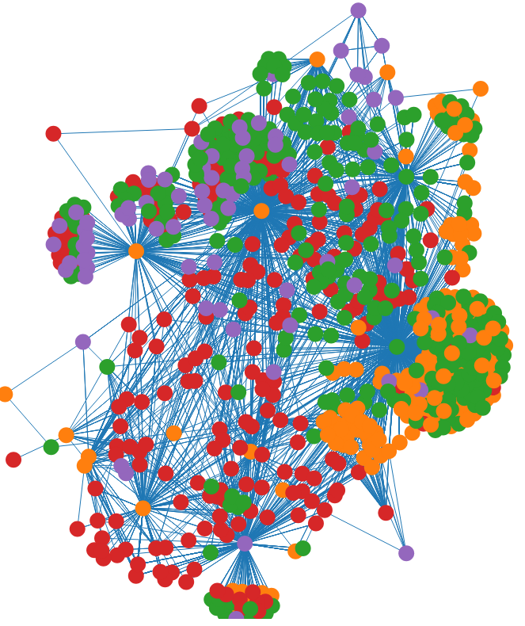

# Demo Agents

These agents showcase how to do instrumentation using AspectJ, ByteBuddy, and Javassist. To develop simple agents, that also don't do the regular "timing" you'll find in any tutorial, this repo creates agents that store each method call *once*. Thereby, call hierarchies at runtime can be reconstructed.

To execute the demo, execute the following steps:

1. Clone and prepare an example project. You can use any Java project, so far, I've tested this with Kafka:
1.1 `git clone https://github.com/apache/kafka && cd kafka && git checkout 42f74a1c3afd693a16c3980ee022e82872e4bfa2`
1.2 `KAFKA_CLUSTER_ID="$(bin/kafka-storage.sh random-uuid)"`
1.3 `bin/kafka-storage.sh format --standalone -t $KAFKA_CLUSTER_ID -c config/kraft/reconfig-server.properties`
2. Depending on the agent you want to use, switch to the folder and build it (e.g.,  `cd javassist-agent/ && mvn clean package`)
3. Start an execution using your agent:
3.1 Set the `$EXTRA_ARGS` of Kafka to start using the `-javaagent`, for example `export EXTRA_ARGS="-javaagent:$DEMO_AGENT_FOLDER/javassist-agent/target/javassist-agent-0.0.1-SNAPSHOT.jar"` (in case of AspectJ, add the specification which `aop.xml` should be used: `-Dorg.aspectj.weaver.loadtime.configuration=file:$DEMO_AGENT_FOLDER/aspectj-agent/aop.xml`
3.2 Start the server: `bin/kafka-server-start.sh config/kraft/reconfig-server.properties` (in the Kafka folder)
3.3 Do whatever you like to do, and stop the server using Ctrl + C.
4. Plot the results: ./process.sh and open visualization.html. This will yield something like the following:

The graph shows which method calls which, and each color represents a package in Kafka (where orange nodes are not prefixed by org.kafka). 

This is just a very basic example of the usage of different kinds of agents. For more complex analysis of runtime behavior, it makes sense to use existing observability solutions like [Kieker](https://github.com/kieker-monitoring/kieker) or [OpenTelemetry](https://github.com/open-telemetry/opentelemetry-java-instrumentation) for instrumentation and the related analysis tools. Only for very specific use cases, the development of own agents makes sense.
